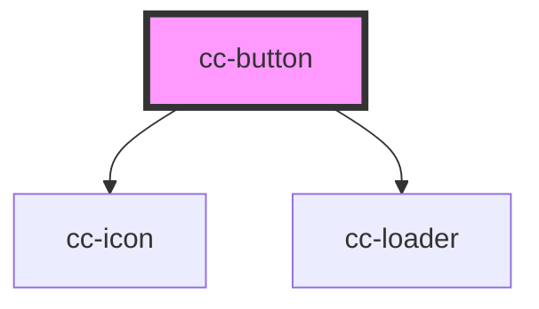

# cc-button

<!-- Auto Generated Below -->

## Properties

| Property      | Attribute      | Description | Type                              | Default     |
| ------------- | -------------- | ----------- | --------------------------------- | ----------- |
| `color`       | `color`        |             | `"primary" \| "secondary"`        | `"primary"` |
| `disabled`    | `disabled`     |             | `boolean`                         | `false`     |
| `download`    | `download`     |             | `boolean`                         | `false`     |
| `expand`      | `expand`       |             | `boolean`                         | `false`     |
| `fill`        | `fill`         |             | `"clear" \| "outline" \| "solid"` | `"solid"`   |
| `glow`        | `glow`         |             | `boolean`                         | `false`     |
| `href`        | `href`         |             | `string`                          | `undefined` |
| `iconName`    | `icon-name`    |             | `string`                          | `""`        |
| `iconOnly`    | `icon-only`    |             | `boolean`                         | `false`     |
| `iconReverse` | `icon-reverse` |             | `boolean`                         | `false`     |
| `loading`     | `loading`      |             | `boolean`                         | `false`     |
| `size`        | `size`         |             | `"lg" \| "md" \| "sm"`            | `"lg"`      |
| `target`      | `target`       |             | `string`                          | `undefined` |
| `type`        | `type`         |             | `"button" \| "submit"`            | `"button"`  |

## Dependencies

### Depends on

- [cc-icon](../cc-icon)
- [cc-loader](../cc-loader)

### Graph

----------------------------------------------

*Built with [StencilJS](https://stenciljs.com/)*
