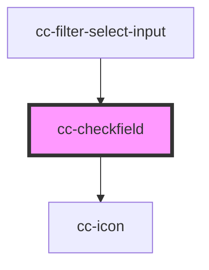

# cc-checkfield

<!-- Auto Generated Below -->

## Properties

| Property   | Attribute  | Description | Type                       | Default      |
| ---------- | ---------- | ----------- | -------------------------- | ------------ |
| `checked`  | `checked`  |             | `boolean`                  | `false`      |
| `color`    | `color`    |             | `"primary" \| "secondary"` | `"primary"`  |
| `disabled` | `disabled` |             | `boolean`                  | `false`      |
| `error`    | `error`    |             | `boolean`                  | `false`      |
| `label`    | `label`    |             | `string`                   | `undefined`  |
| `name`     | `name`     |             | `string`                   | `undefined`  |
| `shape`    | `shape`    |             | `"circle" \| "square"`     | `"square"`   |
| `size`     | `size`     |             | `"medium" \| "small"`      | `"small"`    |
| `type`     | `type`     |             | `"checkbox" \| "radio"`    | `"checkbox"` |
| `value`    | `value`    |             | `string`                   | `undefined`  |

## Dependencies

### Used by

 - [cc-filter-select-input](../cc-filter-select-input)

### Depends on

- [cc-icon](../cc-icon)

### Graph

----------------------------------------------

*Built with [StencilJS](https://stenciljs.com/)*
