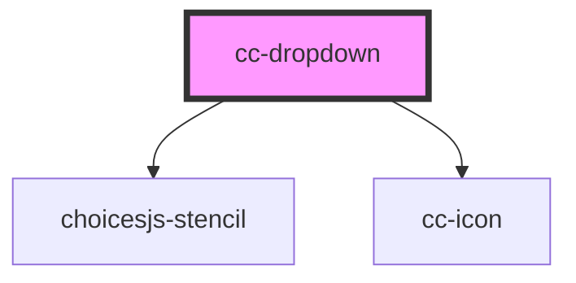

# cc-dropdown

<!-- Auto Generated Below -->

## Properties

| Property         | Attribute       | Description | Type                       | Default                 |
| ---------------- | --------------- | ----------- | -------------------------- | ----------------------- |
| `choices`        | --              |             | `any[]`                    | `[]`                    |
| `color`          | `color`         |             | `"primary" \| "secondary"` | `"primary"`             |
| `currentValue`   | `current-value` |             | `string`                   | `""`                    |
| `disabled`       | `disabled`      |             | `boolean`                  | `false`                 |
| `error`          | `error`         |             | `boolean`                  | `false`                 |
| `iconName`       | `icon-name`     |             | `string`                   | `"chevron-down"`        |
| `label`          | `label`         |             | `string`                   | `""`                    |
| `name`           | `name`          |             | `string`                   | `''`                    |
| `onChangeChoice` | --              |             | `(e: any) => void`         | `(e: any) => {void(e)}` |
| `onClick`        | --              |             | `(e: any) => void`         | `(e: any) => {void(e)}` |
| `onInput`        | --              |             | `(e: any) => void`         | `(e: any) => {void(e)}` |
| `placeholder`    | `placeholder`   |             | `string`                   | `''`                    |
| `size`           | `size`          |             | `"lg" \| "md" \| "sm"`     | `"lg"`                  |

## Dependencies

### Depends on

- choicesjs-stencil
- [cc-icon](../cc-icon)

### Graph

----------------------------------------------

*Built with [StencilJS](https://stenciljs.com/)*
