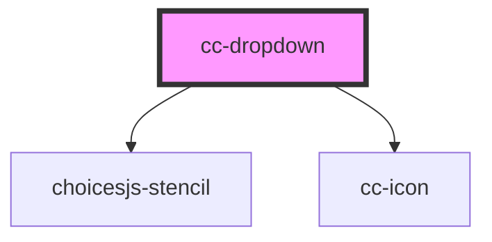

# cc-dropdown

<!-- Auto Generated Below -->

## Properties

| Property   | Attribute   | Description | Type                       | Default          |
| ---------- | ----------- | ----------- | -------------------------- | ---------------- |
| `choices`  | --          |             | `any[]`                    | `[]`             |
| `color`    | `color`     |             | `"primary" \| "secondary"` | `"primary"`      |
| `disabled` | `disabled`  |             | `boolean`                  | `false`          |
| `error`    | `error`     |             | `boolean`                  | `false`          |
| `expand`   | `expand`    |             | `boolean`                  | `false`          |
| `fill`     | `fill`      |             | `"clear" \| "outline"`     | `"outline"`      |
| `iconName` | `icon-name` |             | `string`                   | `"chevron-down"` |
| `label`    | `label`     |             | `string`                   | `""`             |
| `size`     | `size`      |             | `"lg" \| "md" \| "sm"`     | `"lg"`           |

## Dependencies

### Depends on

- choicesjs-stencil
- [cc-icon](../cc-icon)

### Graph

----------------------------------------------

*Built with [StencilJS](https://stenciljs.com/)*
