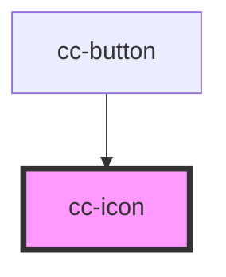

# cc-icon

<!-- Auto Generated Below -->

## Properties

| Property | Attribute | Description | Type                                                    | Default           |
| -------- | --------- | ----------- | ------------------------------------------------------- | ----------------- |
| `color`  | `color`   |             | `"color-text-01" \| "color-text-02" \| "color-text-03"` | `"color-text-01"` |
| `name`   | `name`    |             | `string`                                                | `undefined`       |
| `size`   | `size`    |             | `number`                                                | `24`              |

## Dependencies

### Used by

 - [cc-button](../cc-button)

### Graph

----------------------------------------------

*Built with [StencilJS](https://stenciljs.com/)*
