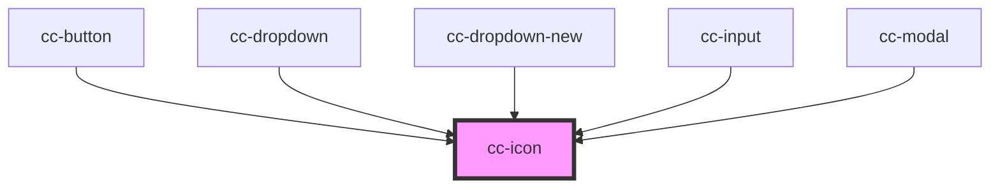

# cc-icon

<!-- Auto Generated Below -->

## Properties

| Property | Attribute | Description | Type     | Default     |
| -------- | --------- | ----------- | -------- | ----------- |
| `name`   | `name`    |             | `string` | `undefined` |
| `size`   | `size`    |             | `number` | `24`        |

## Dependencies

### Used by

 - [cc-button](../cc-button)
 - [cc-dropdown](../cc-dropdown)
 - [cc-dropdown-new](../cc-dropdown-new)
 - [cc-input](../cc-input)
 - [cc-modal](../cc-modal)

### Graph

----------------------------------------------

*Built with [StencilJS](https://stenciljs.com/)*
