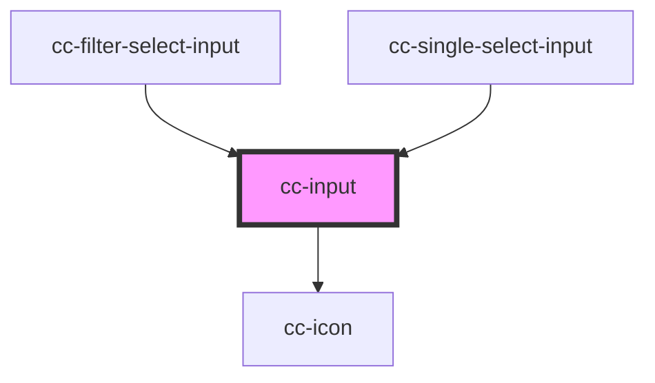

# cc-input

<!-- Auto Generated Below -->

## Properties

| Property       | Attribute      | Description | Type                               | Default     |
| -------------- | -------------- | ----------- | ---------------------------------- | ----------- |
| `autocomplete` | `autocomplete` |             | `string`                           | `""`        |
| `bgField`      | `bg-field`     |             | `string`                           | `""`        |
| `border`       | `border`       |             | `boolean`                          | `true`      |
| `color`        | `color`        |             | `"primary" \| "secondary"`         | `"primary"` |
| `disabled`     | `disabled`     |             | `boolean`                          | `false`     |
| `error`        | `error`        |             | `boolean`                          | `false`     |
| `helperText`   | `helper-text`  |             | `string`                           | `undefined` |
| `iconName`     | `icon-name`    |             | `string`                           | `undefined` |
| `inputRef`     | --             |             | `(el: HTMLInputElement) => void`   | `undefined` |
| `label`        | `label`        |             | `string`                           | `undefined` |
| `maxLength`    | `max-length`   |             | `number`                           | `undefined` |
| `name`         | `name`         |             | `string`                           | `undefined` |
| `placeholder`  | `placeholder`  |             | `string`                           | `undefined` |
| `success`      | `success`      |             | `boolean`                          | `false`     |
| `type`         | `type`         |             | `"number" \| "password" \| "text"` | `"text"`    |
| `value`        | `value`        |             | `string`                           | `undefined` |

## Dependencies

### Used by

 - [cc-filter-select-input](../cc-filter-select-input)
 - [cc-single-select-input](../cc-single-select-input)

### Depends on

- [cc-icon](../cc-icon)

### Graph

----------------------------------------------

*Built with [StencilJS](https://stenciljs.com/)*
