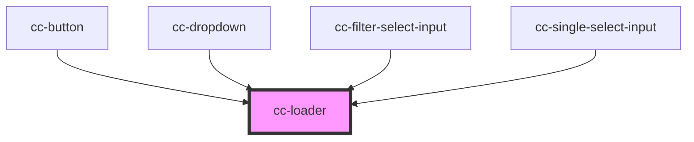

# cc-loader

<!-- Auto Generated Below -->

## Properties

| Property | Attribute | Description | Type     | Default |
| -------- | --------- | ----------- | -------- | ------- |
| `size`   | `size`    |             | `number` | `24`    |

## Dependencies

### Used by

 - [cc-button](../cc-button)
 - [cc-dropdown](../cc-dropdown)
 - [cc-filter-select-input](../cc-filter-select-input)
 - [cc-single-select-input](../cc-single-select-input)

### Graph

----------------------------------------------

*Built with [StencilJS](https://stenciljs.com/)*
