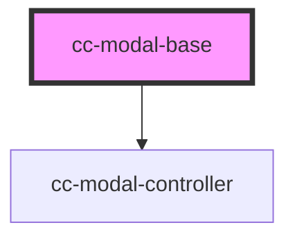

# cc-modal

<!-- Auto Generated Below -->

## Properties

| Property  | Attribute | Description | Type           | Default |
| --------- | --------- | ----------- | -------------- | ------- |
| `size`    | `size`    |             | `"md" \| "sm"` | `"md"`  |
| `visible` | `visible` |             | `boolean`      | `false` |

## Events

| Event    | Description | Type               |
| -------- | ----------- | ------------------ |
| `cancel` |             | `CustomEvent<any>` |
| `close`  |             | `CustomEvent<any>` |

## Dependencies

### Depends on

- [cc-modal-controller](../cc-modal-controller)

### Graph

----------------------------------------------

*Built with [StencilJS](https://stenciljs.com/)*
