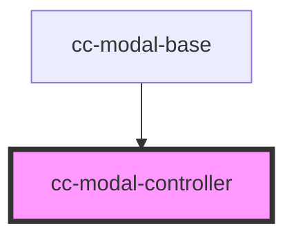

# cc-modal-controller

<!-- Auto Generated Below -->

## Properties

| Property   | Attribute | Description | Type          | Default     |
| ---------- | --------- | ----------- | ------------- | ----------- |
| `modalRef` | --        |             | `HTMLElement` | `undefined` |

## Dependencies

### Used by

 - [cc-modal-base](../cc-modal-base)

### Graph

----------------------------------------------

*Built with [StencilJS](https://stenciljs.com/)*
