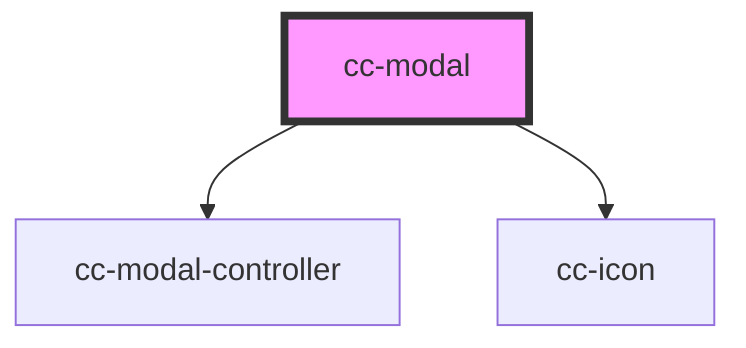

# cc-modal

<!-- Auto Generated Below -->

## Properties

| Property          | Attribute           | Description | Type                       | Default     |
| ----------------- | ------------------- | ----------- | -------------------------- | ----------- |
| `color`           | `color`             |             | `"primary" \| "secondary"` | `"primary"` |
| `disableESC`      | `disable-e-s-c`     |             | `boolean`                  | `false`     |
| `hideCloseButton` | `hide-close-button` |             | `boolean`                  | `false`     |
| `size`            | `size`              |             | `"md" \| "sm"`             | `"md"`      |
| `visible`         | `visible`           |             | `boolean`                  | `false`     |

## Events

| Event    | Description | Type               |
| -------- | ----------- | ------------------ |
| `cancel` |             | `CustomEvent<any>` |
| `close`  |             | `CustomEvent<any>` |

## Dependencies

### Depends on

- [cc-modal-controller](../cc-modal-controller)
- [cc-icon](../cc-icon)

### Graph

----------------------------------------------

*Built with [StencilJS](https://stenciljs.com/)*
