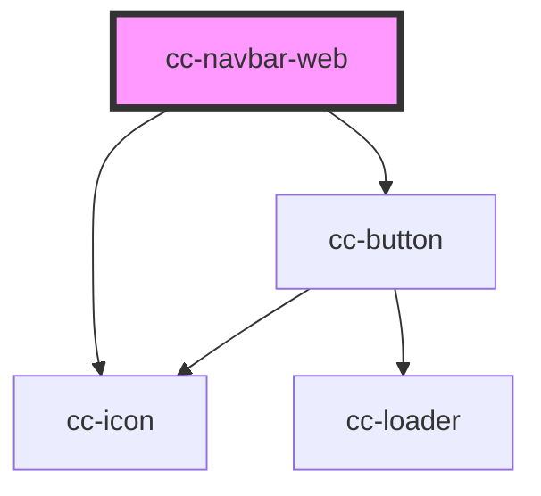

# cc-dropdown

<!-- Auto Generated Below -->

## Properties

| Property   | Attribute   | Description | Type      | Default |
| ---------- | ----------- | ----------- | --------- | ------- |
| `disabled` | `disabled`  |             | `boolean` | `false` |
| `iconOnly` | `icon-only` |             | `boolean` | `false` |

## Dependencies

### Depends on

- [cc-button](../cc-button)
- [cc-icon](../cc-icon)

### Graph

----------------------------------------------

*Built with [StencilJS](https://stenciljs.com/)*
