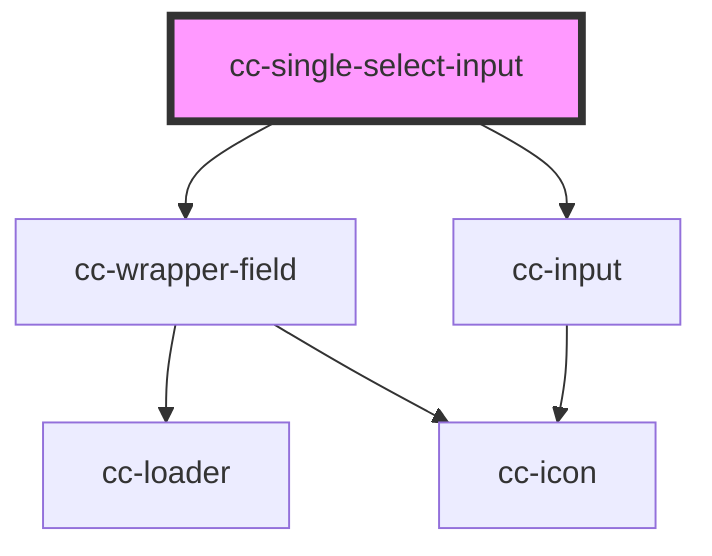

# cc-single-select-input

<!-- Auto Generated Below -->

## Properties

| Property              | Attribute                | Description | Type                       | Default          |
| --------------------- | ------------------------ | ----------- | -------------------------- | ---------------- |
| `IconRotate`          | `icon-rotate`            |             | `boolean`                  | `true`           |
| `autocomplete`        | `autocomplete`           |             | `boolean`                  | `false`          |
| `bgField`             | `bg-field`               |             | `string`                   | `""`             |
| `border`              | `border`                 |             | `boolean`                  | `true`           |
| `choices`             | --                       |             | `any[]`                    | `undefined`      |
| `color`               | `color`                  |             | `"primary" \| "secondary"` | `"primary"`      |
| `currentValue`        | `current-value`          |             | `string`                   | `""`             |
| `disabled`            | `disabled`               |             | `boolean`                  | `false`          |
| `error`               | `error`                  |             | `boolean`                  | `false`          |
| `fieldReadonly`       | `field-readonly`         |             | `boolean`                  | `false`          |
| `helperText`          | `helper-text`            |             | `string`                   | `undefined`      |
| `hideItemsIfSelected` | `hide-items-if-selected` |             | `boolean`                  | `false`          |
| `iconName`            | `icon-name`              |             | `string`                   | `"chevron-down"` |
| `label`               | `label`                  |             | `string`                   | `""`             |
| `loader`              | `loader`                 |             | `boolean`                  | `false`          |
| `name`                | `name`                   |             | `string`                   | `""`             |
| `placeholder`         | `placeholder`            |             | `string`                   | `""`             |

## Events

| Event          | Description | Type               |
| -------------- | ----------- | ------------------ |
| `changeChoice` |             | `CustomEvent<any>` |

## Dependencies

### Depends on

- [cc-wrapper-field](../cc-wrapper-field)
- [cc-input](../cc-input)

### Graph

----------------------------------------------

*Built with [StencilJS](https://stenciljs.com/)*
