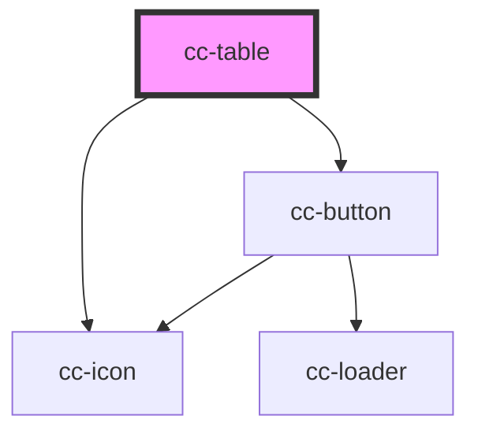

# cc-table

<!-- Auto Generated Below -->

## Properties

| Property      | Attribute      | Description | Type                       | Default                                                                     |
| ------------- | -------------- | ----------- | -------------------------- | --------------------------------------------------------------------------- |
| `borderColor` | `border-color` |             | `"primary" \| "secondary"` | `"secondary"`                                                               |
| `codeTeacher` | `code-teacher` |             | `string`                   | `""`                                                                        |
| `lastname`    | `lastname`     |             | `string`                   | `""`                                                                        |
| `name`        | `name`         |             | `string`                   | `""`                                                                        |
| `section`     | `section`      |             | `string`                   | `""`                                                                        |
| `status`      | `status`       |             | `string`                   | `""`                                                                        |
| `thumbnail`   | `thumbnail`    |             | `string`                   | `"https://d1yy3d44605rg6.cloudfront.net/static/media/student.176fd80a.svg"` |
| `total`       | `total`        |             | `number`                   | `0`                                                                         |

## Dependencies

### Depends on

- [cc-button](../cc-button)
- [cc-icon](../cc-icon)

### Graph

----------------------------------------------

*Built with [StencilJS](https://stenciljs.com/)*
