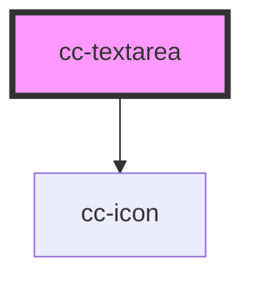

# cc-textarea

<!-- Auto Generated Below -->

## Properties

| Property           | Attribute            | Description | Type                             | Default     |
| ------------------ | -------------------- | ----------- | -------------------------------- | ----------- |
| `autoGrow`         | `auto-grow`          |             | `boolean`                        | `false`     |
| `bgField`          | `bg-field`           |             | `"transparent" \| "white"`       | `"white"`   |
| `color`            | `color`              |             | `"primary" \| "secondary"`       | `"primary"` |
| `counter`          | `counter`            |             | `boolean`                        | `false`     |
| `disabled`         | `disabled`           |             | `boolean`                        | `false`     |
| `enableImage`      | `enable-image`       |             | `boolean`                        | `undefined` |
| `enableMediaEmbed` | `enable-media-embed` |             | `boolean`                        | `false`     |
| `error`            | `error`              |             | `boolean`                        | `false`     |
| `helperText`       | `helper-text`        |             | `string`                         | `undefined` |
| `iconName`         | `icon-name`          |             | `string`                         | `undefined` |
| `imageService`     | --                   |             | `(file: any) => Promise<string>` | `undefined` |
| `label`            | `label`              |             | `string`                         | `undefined` |
| `maxLength`        | `max-length`         |             | `number`                         | `undefined` |
| `name`             | `name`               |             | `string`                         | `undefined` |
| `outlined`         | `outlined`           |             | `boolean`                        | `false`     |
| `placeholder`      | `placeholder`        |             | `string`                         | `undefined` |
| `rich`             | `rich`               |             | `boolean`                        | `false`     |
| `success`          | `success`            |             | `boolean`                        | `false`     |
| `toolbar`          | --                   |             | `string[]`                       | `undefined` |
| `value`            | `value`              |             | `string`                         | `undefined` |
| `withoutRadius`    | `without-radius`     |             | `boolean`                        | `false`     |

## Events

| Event        | Description | Type                  |
| ------------ | ----------- | --------------------- |
| `changeText` |             | `CustomEvent<string>` |

## Methods

### `focusTextEditor() => Promise<void>`

#### Returns

Type: `Promise<void>`

### `setDataRichEditor(data: string) => Promise<void>`

#### Returns

Type: `Promise<void>`

## Dependencies

### Depends on

- [cc-icon](../cc-icon)

### Graph

----------------------------------------------

*Built with [StencilJS](https://stenciljs.com/)*
