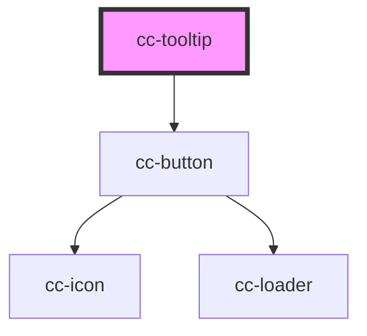

# cc-tooltip

<!-- Auto Generated Below -->

## Properties

| Property          | Attribute           | Description | Type                    | Default     |
| ----------------- | ------------------- | ----------- | ----------------------- | ----------- |
| `customWidth`     | `custom-width`      |             | `string`                | `""`        |
| `hideCloseButton` | `hide-close-button` |             | `boolean`               | `true`      |
| `imagePath`       | `image-path`        |             | `string`                | `""`        |
| `message`         | `message`           |             | `HTMLElement \| string` | `undefined` |
| `positionElement` | --                  |             | `HTMLElement`           | `undefined` |
| `visible`         | `visible`           |             | `boolean`               | `false`     |

## Dependencies

### Depends on

- [cc-button](../cc-button)

### Graph

----------------------------------------------

*Built with [StencilJS](https://stenciljs.com/)*
