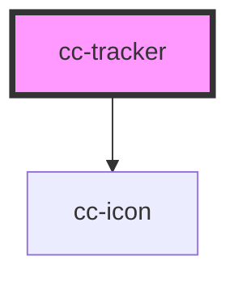

# cc-tracker

<!-- Auto Generated Below -->

## Properties

| Property       | Attribute       | Description | Type             | Default     |
| -------------- | --------------- | ----------- | ---------------- | ----------- |
| `readonly`     | `readonly`      |             | `boolean`        | `false`     |
| `showProgress` | `show-progress` |             | `boolean`        | `true`      |
| `trackersList` | --              |             | `ITrackerList[]` | `undefined` |
| `withoutLabel` | `without-label` |             | `boolean`        | `false`     |

## Events

| Event           | Description | Type               |
| --------------- | ----------- | ------------------ |
| `changeTracker` |             | `CustomEvent<any>` |

## Dependencies

### Depends on

- [cc-icon](../cc-icon)

### Graph

----------------------------------------------

*Built with [StencilJS](https://stenciljs.com/)*
