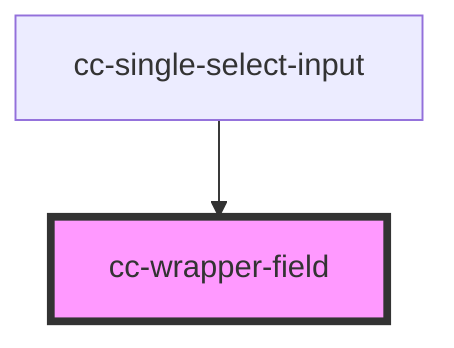

# cc-dropdown-new

<!-- Auto Generated Below -->

## Properties

| Property        | Attribute        | Description | Type                       | Default     |
| --------------- | ---------------- | ----------- | -------------------------- | ----------- |
| `bgField`       | `bg-field`       |             | `string`                   | `""`        |
| `border`        | `border`         |             | `boolean`                  | `true`      |
| `color`         | `color`          |             | `"primary" \| "secondary"` | `"primary"` |
| `disabled`      | `disabled`       |             | `boolean`                  | `false`     |
| `error`         | `error`          |             | `boolean`                  | `false`     |
| `fieldReadonly` | `field-readonly` |             | `boolean`                  | `false`     |
| `iconOnly`      | `icon-only`      |             | `boolean`                  | `false`     |
| `isActive`      | `is-active`      |             | `boolean`                  | `false`     |
| `isFocus`       | `is-focus`       |             | `boolean`                  | `false`     |
| `loader`        | `loader`         |             | `boolean`                  | `false`     |

## Dependencies

### Used by

 - [cc-single-select-input](../cc-single-select-input)

### Graph

----------------------------------------------

*Built with [StencilJS](https://stenciljs.com/)*
